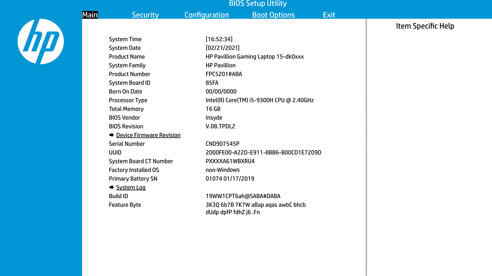
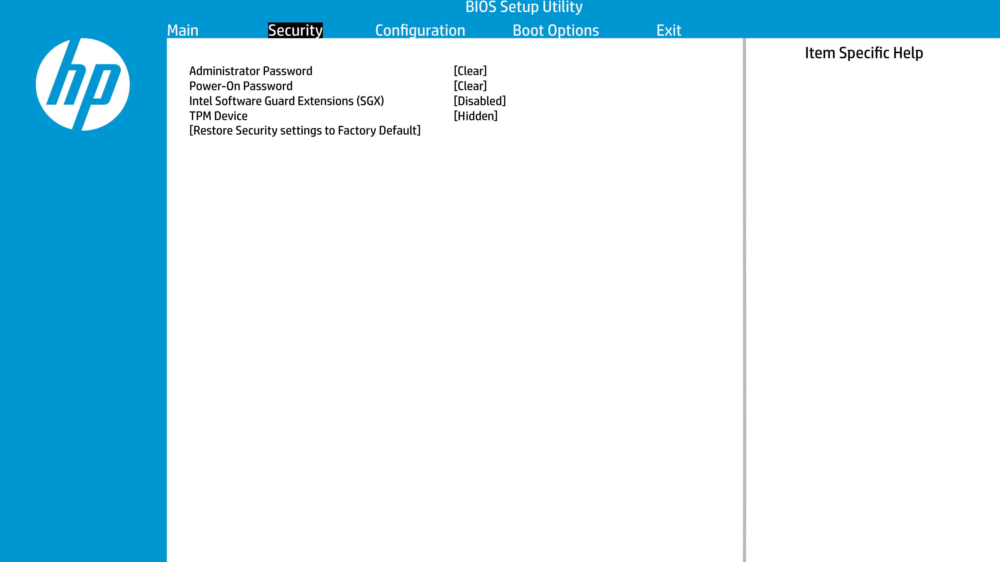
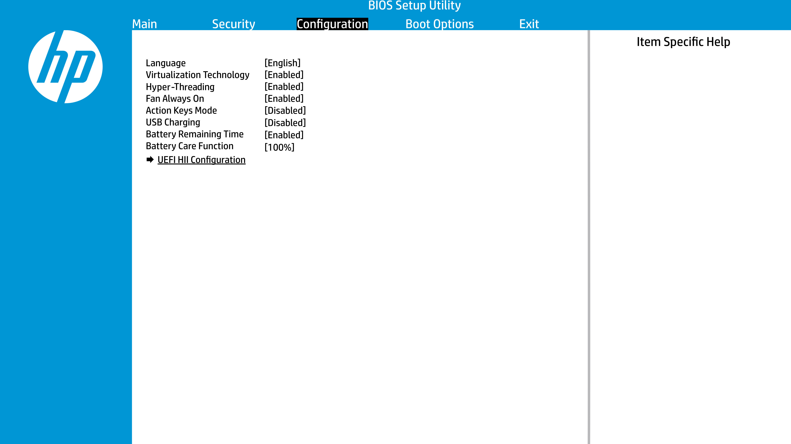
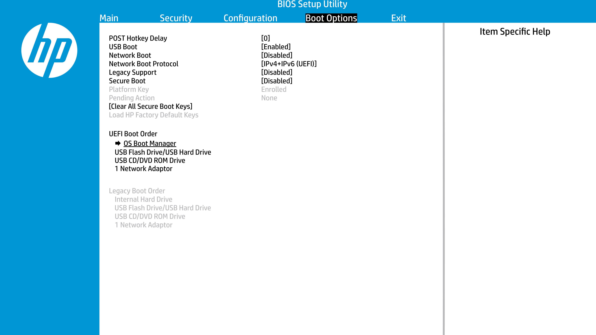

# HP Pavilion Gaming 15-dk00xxxx Hackintosh OpenCore

**Status: Finished (Active - monthly updated) | Stable**  
**Current version: Big Sur 11.2 (20D64)**

## Introduction

**DISCLAIMER:**
Read the entire [Dortania](https://dortania.github.io/OpenCore-Install-Guide) guide before you start. I'm not responsible for any damage.
When you encounter bug or want to improve this repo, consider opening issue or pull request.
If you think that configuration is useful for you, consider to give a star for this repository :).

    <strong>Hardware configuration</strong>

### **HP Pavilion Gaming 15-dk0021nw**

 

 

 | Component       | Manufacturer and model                                | Additional description           |
 | --------------- | ----------------------------------------------------- | -------------------------------- |
 | CPU             | Intel Core i5-9300H (9th gen - Coffee Lake Plus)      |                                  |
 | GPU             | Intel Graphics UHD 630                                |                                  |
 | External GPU    | NVIDIA GeForce GTX 1650 Graphics 4 GB GDDR5           | Disabled via SSDT                |
 | Screen          | 15.6" FHD IPS anti-glare (1920 x 1080)                |                                  |
 | RAM             | 16 GB DDR4 2667 MHz (1 x 8GB Samsung and 1 x 8GB Goodram)|                               |
 | SSD Primary     | GOODRAM IRDM PRO 240GB 2,5" SATA III                  | Disk for macOS and Manjaro Linux |
 | SSD Secondary   | Kingston A2000 (SA2000M8500G) 500GB M.2 NVMe          | Disk for Windows 10              |
 | Audio           | Realtek ALC285                                        |                                  |
 | Wireless        | Intel Wireless AC 9560                                |                                  |
 | LAN             | Realtek RTL8168/8111 PCI-E Gigabit Ethernet Adapter   |                                  |
 | SD card reader  | Alcor Micro AU6625 PCI-E                              | Not working natively in macOS, see `Working with workarounds` section |
 | BIOS version    | F.40 Rev.A                                            |                                  |

  

    <strong>Kernel extensions</strong>

| Kext                        | Version        | Additional description |
| :-------------------------: | :------------: | ---------------------- |
| [AirportItlwm](https://github.com/OpenIntelWireless/itlwm/releases)         | 1.2.0 | |
| [AppleALC](https://github.com/acidanthera/AppleALC/releases)                | 1.5.7 | |
| [CPUFriend](https://github.com/acidanthera/CPUFriend/releases)              | 1.2.3 | |
| [CPUFriendDataProvider](https://github.com/corpnewt/CPUFriendFriend)        |  N/A  | Generated using [CPUFriendFriend](https://github.com/corpnewt/CPUFriendFriend) tool, recommended to create your own configuration. Tread it as sample.|
| [CtlnaAHCIPort](https://github.com/dortania/OpenCore-Install-Guide/blob/master/extra-files/CtlnaAHCIPort.kext.zip)|  N/A  | Kext helps to detect GOODRAM SSD on MacOS Big Sur, founded in [Opencore Install Guide](https://github.com/dortania/OpenCore-Install-Guide/blob/master/extra-files/CtlnaAHCIPort.kext.zip) repository (current version points to 22/08/2020).|
| [IntelBluetoothFirmware](https://github.com/OpenIntelWireless/IntelBluetoothFirmware/releases)| 1.1.2 | |
| [IntelBluetoothInjector](https://github.com/OpenIntelWireless/IntelBluetoothFirmware/releases)| 1.1.2 | |
| [Lilu](https://github.com/acidanthera/lilu/releases)                        | 1.5.1 | |
| [NVMeFix](https://github.com/acidanthera/NVMeFix/releases)                  | 1.0.5 | |
| [RealtekRTL8111](https://github.com/Mieze/RTL8111_driver_for_OS_X/releases) | 2.3.0 | |
| [SMCBatteryManager](https://github.com/acidanthera/virtualsmc/releases)     | 1.2.0 | |
| [SMCProcessor](https://github.com/acidanthera/virtualsmc/releases)          | 1.2.0 | |
| [SMCSuperIO](https://github.com/acidanthera/virtualsmc/releases)            | 1.2.0 | |
| [USBMap](https://github.com/corpnewt/USBMap)                                |  N/A  | Please use USBInjectAll.kext to system installation and  after it generate your own version of USBMap using [USBMap](https://github.com/corpnewt/USBMap) or [Hackintool](https://github.com/headkaze/Hackintool). Tread it as sample.|
| [VirtualSMC](https://github.com/acidanthera/virtualsmc/releases)            | 1.2.0 | |
| [VoodooI2C](https://github.com/VoodooI2C/VoodooI2C/releases)                | 2.6.4 | |
| [VoodooI2CHID](https://github.com/VoodooI2C/VoodooI2C/releases)             | 2.6.4 | |
| [VoodooPS2Controller](https://github.com/acidanthera/VoodooPS2/releases)    | 2.2.1 | |
| [WhateverGreen](https://github.com/acidanthera/whatevergreen/releases)      | 1.4.7 | From version 1.4.6 I need to add boot argument `-igfxblr` to fix black screen on system loading.|

    <strong>UEFI drivers</strong>

|     Driver      | Version           |
| :-------------: | :---------------: |
| OpenHfsPlus.efi | OpenCorePkg 0.6.6 |
| OpenCanopy.efi  | OpenCorePkg 0.6.6 |
| OpenRuntime.efi | OpenCorePkg 0.6.6 |

## Recommended UEFI/BIOS settings

  

    <strong>UEFI/BIOS Setup</strong>

    <strong>Security</strong>

- `Intel Software Guard Extensions (SGX) -> Disabled`
- `TPM Device -> Disabled`

    <strong>Configuration</strong>

- `Virtualization Technology -> Enabled`
- `Hyper-Threading -> Enabled`

    <strong>Boot Options</strong>

- `Legacy Support -> Disabled`
- `Secure Boot -> Disabled`

    <strong>Full configuration details</strong>

 

 

 

## Configuration advices (config.plist)

You can find configuration guide for Coffee Lake Plus laptops on [dortania.github.io](https://dortania.github.io/OpenCore-Install-Guide/config-laptop.plist/coffee-lake-plus.html#starting-point) site.
Below I presented details of config.plist that allow me to run system without problems
(after system installation). The most properties are the same as in Dortania guide,
but I also need to change some of them due to problems with booting of system installer.

    <strong>ACPI</strong>

- **Add**
  - Patches recommended via Dortania guide:
    - `SSDT-AWAC.aml`
    - `SSDT-EC-USBX-LAPTOP.aml`
    - `SSDT-PLUG-DRTNIA.aml`
    - `SSDT-PNLF-CFL.aml`
    - `SSDT-XOSI.aml`

  - Additional patches:
    - `SSDT-GPRW.aml` - instant wake fix patch
    - `SSDT-dGPU-Off.aml` - disable of dedicated NVIDIA GPU

- **Patch**
  - Change _OSI to XOSI:
    - `Comment -> Change _OSI to XOSI`
    - `Enabled -> True`
    - `Count -> 0`
    - `Limit -> 0`
    - `Find -> 5F4F5349`
    - `Replace -> 584F5349`
 
  - Change Method(GPRW,2,N) to XPRW, pair with SSDT-GPRW.aml:
    - `Comment -> change Method(GPRW,2,N) to XPRW, pair with SSDT-GPRW.aml`
    - `Enabled -> True`
    - `Count -> 0`
    - `Limit -> 0`
    - `Find -> 47505257 02`
    - `Replace -> 58505257 02`

    <strong>Booter</strong>

**Note**: In Quirks section I need to set different values than in Dortania guide for 
`DevirtualiseMmio`, `RebuildAppleMemoryMap` and `SyncRuntimePermissions` due to problems with booting (kernel panic).

- **Quirks**
  - `AllowRelocationBlock -> False`
  - `AvoidRuntimeDefrag -> True`
  - `DevirtualiseMmio -> False`
  - `DisableSingleUser -> False`
  - `DisableVariableWrite -> False`
  - `DiscardHibernateMap -> False`
  - `EnableSafeModeSlide -> True`
  - `EnableWriteUnprotector -> False`
  - `ForceExitBootServices -> False`
  - `ProtectMemoryRegions -> False`
  - `ProtectSecureBoot -> False`
  - `ProtectUefiServices -> True`
  - `ProvideCustomSlide -> True`
  - `ProvideMaxSlide -> 0`
  - `RebuildAppleMemoryMap -> False`
  - `SetupVirtualMap -> True`
  - `SignalAppleOS -> False`
  - `SyncRuntimePermissions -> False`

    <strong>DeviceProperties</strong>

- **Add**
  - Audio support
    - `PciRoot(0x0)/Pci(0x1F,0x3)`
      - `layout-id -> 0B000000`
      - `alc-delay -> 1000`

  - IGPU support
    - `PciRoot(0x0)/Pci(0x2,0x0)`
      - `AAPL,ig-platform-id -> 0900A53E`
      - `device-id -> 9B3E0000`

    <strong>Kernel</strong>

- **Quirks**
  - `AppleCpuPmCfgLock -> False`
  - `AppleXcpmCfgLock -> True`
  - `AppleXcpmExtraMsrs -> False`
  - `AppleXcpmForceBoost -> False`
  - `CustomSMBIOSGuid -> False`
  - `DisableIoMapper -> True`
  - `DisableLinkeditJettison -> True`
  - `DisableRtcChecksum -> False`
  - `ExtendBTFeatureFlags -> False`
  - `ExternalDiskIcons -> False`
  - `ForceSecureBootScheme -> False`
  - `IncreasePciBarSize -> False`
  - `LapicKernelPanic -> True`
  - `LegacyCommpage -> False`
  - `PanicNoKextDump -> True`
  - `SetApfsTrimTimeout -> -1`
  - `ThirdPartyDrives -> False`
  - `XhciPortLimit -> True`

 **Note**: `LapicKernelPanic -> True` is recommended for HP systems (according to Dortania guide).

    <strong>Misc</strong>

- **Boot**
  - `ConsoleAttributes -> 0`
  - `HibernateMode -> None`
  - `HideAuxiliary -> True`
  - `LauncherOption -> Disabled`
  - `LauncherPath -> Default`
  - `PickerAttributes -> 1`
  - `PickerAudioAssist -> False`
  - `PickerMode -> Builtin`
  - `PickerVariant -> Auto`
  - `PollAppleHotKeys -> False`
  - `ShowPicker -> False`
  - `TakeoffDelay -> 0`
  - `Timeout -> 0`

**Note**: I use rEFInd bootloader to select proper OS and in OpenCore I need only default system boot entry of macOS.
If you want to have selection of entries in OpenCore set `HideAuxiliary -> False`, `ShowPicker -> True`
and value of Timeout > 0 eg. `Timeout -> 10` (10 seconds).

- **Debug**
  - `AppleDebug -> False`
  - `ApplePanic -> True`
  - `DisableWatchDog -> True`
  - `DisplayDelay -> 0`
  - `DisplayLevel -> 2147483650`
  - `SerialInit -> False`
  - `SysReport -> False`
  - `Target -> 3`

- **Security**
  - `AllowNvramReset -> True`
  - `AllowSetDefault -> True`
  - `ApECID -> 0`
  - `AuthRestart -> False`
  - `BlacklistAppleUpdate -> True`
  - `DmgLoading -> Signed`
  - `EnablePassword -> False`
  - `ExposeSensitiveData -> 6`
  - `HaltLevel -> 2147483648`
  - `PasswordHash -> <>(empty value)`
  - `PasswordSalt -> <>(empty value)`
  - `ScanPolicy -> 0`
  - `SecureBootModel -> Default`
  - `Vault -> Optional`

    <strong>NVRAM</strong>

    LegacyEnable -> False
    LegacyOverwrite -> False
    WriteFlash -> True

- **Add**
  - System Integrity Protection bitmask
  `7C436110-AB2A-4BBB-A880-FE41995C9F82`
    - `boot-args -> keepsyms=1 -igfxblr`
    - `prev-lang:kbd -> 656E2D55 533A30`

   **Note**: For `boot-args` I added `-igfxblr` flag to prevent black screen on system loading screen.
   This problem appears after upgrading WhateverGreen kext version from 1.4.5 to 1.4.6. 
   Value for `prev-lang:kbd` enables English language for system installer.

    <strong>PlatformInfo</strong>

    Automatic -> True
    CustomMemory -> False
    UpdateDataHub -> True
    UpdateNVRAM -> True
    UpdateSMBIOS -> True
    UpdateSMBIOSMode -> Create
    UseRawUuidEncoding -> False

- **Generic**
  - `AdviseWindows -> False`
  - `MaxBIOSVersion -> False`
  - `ProcessorType -> 0`
  - `ROM -> 11223344 5566`
  - `SpoofVendor -> True`
  - `SystemMemoryStatus -> Auto`

 **Note**: You need to generate your own values for `SystemProductName`, `SystemSerialNumber`, `MLB` and `SystemUUID` using [GenSMBIOS](https://github.com/corpnewt/GenSMBIOS).
 I'm using SMBIOS for MacBookPro15.1, but in Dortania guide it's recommended to use SMBIOS for MacBookPro16.x
 (but when I using MacBookPro16.1 setup my bluetooth device was not recognized by system).

 **Note 2**: I provided random value for `ROM` section because for now I need only working Apple Store in my configuration.
 If you want to set up iMessage or iServices you can find dedicated [Dortania](https://dortania.github.io/OpenCore-Post-Install/universal/iservices.html) guide.

    <strong>UEFI</strong>

- **Quirks**
  - `DisableSecurityPolicy -> False`
  - `ExitBootServicesDelay -> 0`
  - `IgnoreInvalidFlexRatio -> False`
  - `ReleaseUsbOwnership -> True`
  - `RequestBootVarRouting -> True`
  - `TscSyncTimeout -> 0`
  - `UnblockFsConnect -> True`

 **Note**: `UnblockFsConnect -> True` is recommended for HP systems (according to Dortania guide).

## Status

  

    <strong>Not working ❌</strong>

- `HDMI port`
  (but external display connection works, please see `Working with workarounds` section)
- `SD Card Reader`
  (but reading from and writing to SD Card works, please also see `Working with workarounds` section)

  

    <strong>Working with workarounds ⚠️</strong>

- `External display connection with audio:`
  - There is no way to connect external display using HDMI or USB-C ports because there are paired with dedicated graphics card (NVIDIA GTX 1650) which is not supported by macOS higher than High Sierra.
  - `Workaround:` connection using laptop USB 3.0 port and [HDMI to USB 3.0 converter](https://www.cablecreation.com/pl/products/usb-adapter-cd0030.html),
  cost of device is around 30-40$ and you only need to install [DisplayLink](https://www.displaylink.com/downloads) driver to enable it.

- `SD card reading and writing:`
  - I cannot find way to enable Alcor Micro SD card reader (Alcor AU6625 PCI-E chip).
  - `Workaround:` Using USB 3.0 SD card reader. I'm using [Natec SCARAB](https://natec-zone.com/product/card-reader-natec-scarab-sd-micro-sd-usb-3-0-black), works out of the box.

  

    <strong>Working ✅</strong>

- `App Store`
- `Audio` - Realtek ALC285 with sound keys (F7 and F8)
- `Brightness Keys` (reassignment to F2 and F3 keys is recommended)
- `Battery` (management, percentage and actual work time)
- `Bluetooth and Wi-Fi` - Intel Wireless-AC 9650
- `CPU power management / performance`
- `Ethernet port` - Realtek RTL8168/8111
- `Keyboard`
- `IGPU Intel UHD 630`
- `Internal microphone`
- `SATA SSD / NVMe support`
- `Shutdown / Reboot functions`
- `Sleep/Wake` - using Sleep from menu and after laptop lid close/open
- `Speakers and headphones combo jack`
- `System updates` (for now 2 updates for Big Sur were succesfully completed)
- `Touchpad`
- `USB Ports`
- `Web camera`

  

    <strong>Untested ❓</strong>

- `iMessage, FaceTime, iTunes Store`
- `DRM`
- `Sidecar`
- `FireVault 2`

## Extras

This repository beyond Hackintosh EFI configuration also contains items related with macOS
(helpful scripts, boot manager configuration).

  

    <strong>Shutdown on low battery (SOLB) script</strong>

Script based on [SleepOnLowBattery](https://www.tonymacx86.com/threads/release-sleeponlowbattery-solb.264785) from www.tonymacx86.com site.
Based script were written by users BugsB and Toggi3, huge thanks for your work.
My version is a little modification of script version without sound.

- **Features**:
  - `sleep command replaced with shutdown one`
  - `higher values of percents used to warn about low and very low battery`

It protected me several times from complete discharge of the battery :)

  

    <strong>rEFInd Boot Manager configuration</strong>

I use 3 different operating systems on my laptop (macOS, Windows 10 and Manjaro Linux)
and it's necessary for me to select proper system to work on every boot.

I decided to use rEFInd Boot Manager due to problems with setup of Manjaro Linux entry
in OpenCore and it fully meets my expectations.

In extras/refind catalog you can find my refind configuration file (refind.conf)
and files for theme rEFInd-minimal-black (thanks for [@andersfischernielsen](https://github.com/andersfischernielsen/rEFInd-minimal-black) and [@EvanPurkhiser](https://github.com/EvanPurkhiser/rEFInd-minimal)).

## Credits

    <strong>Thanks to:</strong>

- [Apple](https://www.apple.com) - for [macOS](https://www.apple.com/pl/macos/big-sur)
- [Acidanthera](https://github.com/acidanthera) team - for OpenCore and necessary kernel extensions
- [CorpNewt](https://github.com/corpnewt) and [headkaze](https://github.com/headkaze/Hackintool) - for useful tools to install and configure system
- [Dortania](https://github.com/dortania) team - for great Hackintosh tutorials
- [EETagent](https://github.com/EETagent/T480-OpenCore-Hackintosh) - for great Hackintosh README that was my inspiration for this document
- [r/hackintosh](https://www.reddit.com/r/hackintosh) - for helpful advices
- [OpenIntelWireless](https://github.com/OpenIntelWireless) team - for enable of laptop default Intel Wireless Wi-Fi card.
- [Mieze](https://github.com/Mieze/RTL8111_driver_for_OS_X/releases) - for enable of laptop default Realtek sound card
- [VoodooI2C](https://github.com/VoodooI2C) team - for enable of laptop keyboard
- guys mentioned in Extras section
- ... and the rest of not mentioned people who works on Hackintosh project :)
